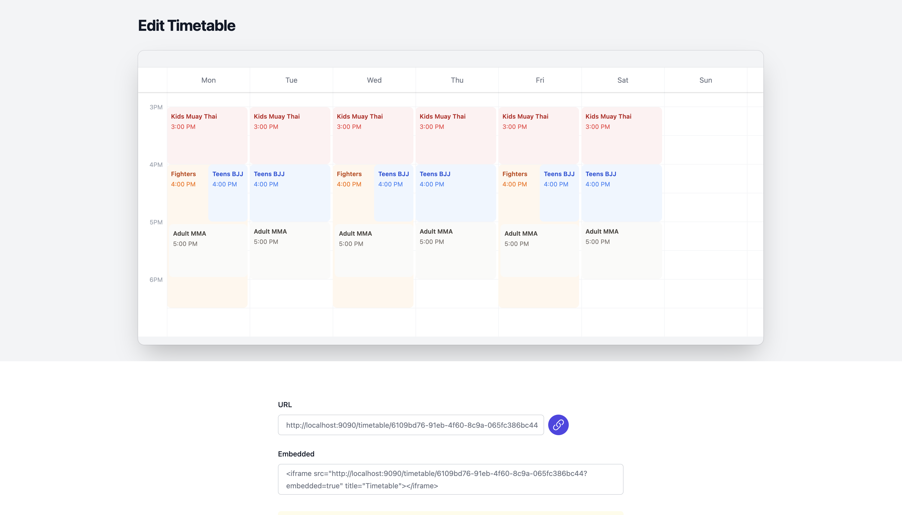

# 🗓️ Timetable Generator
*Generate a responsive timetable from a CSV file*

## Description
Timetable Generator is a complete product that let's users create beautiful timetables from simple CSV files.
It comes with a landing page, product, free trial and paid version. You can link directly to a dedicated page
or embed it as an iFrame.

## Features
- ↗️ Live updates on any changes
- 👆 Interactive
- 📱 Responsive design
- 💰 Payments using Stripe
- 📊 Observability using BetterStack

## Potential Improvements
- 🌠 Export to PNG
- 🧪 Automated UI Testing

## Development
1. Clone this repo
2. Set the following environment variables:
  1. `STACK=local`
  2. `STRIPE_API_KEY` to the Stripe API Key for dev
  3. `SOURCE_TOKEN` to the BetterStack source token (optional)
2. Run `gradle run`
4. Open the landing page on [http://localhost:9090](http://localhost:9090) 🚀

### Tech stack
- Kotlin
- HTML/CSS
- Tailwind
- SQLite
- Stripe
- BetterStack
